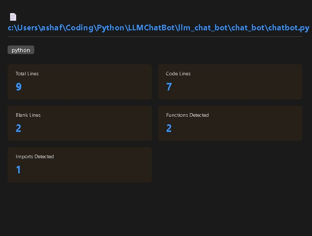

# Repo Blueprint

*(formerly File Stats Panel)*

A VS Code extension that analyzes your repository and displays structural
statistics in a side panel — line counts, function detection, import
analysis, and more. Built to grow into full repository-level insight:
structural diagrams and automated documentation, on top of the file-level
analysis it already provides.

## Features

- Displays total line count, code lines, and blank lines
- Detects and counts function/method definitions
- Counts import statements and dependencies
- Supports JavaScript, TypeScript, Java, and Python

## Screenshot

## How to Use

1. Open any code file in VS Code
2. Open the Command Palette (`Ctrl+Shift+P` / `Cmd+Shift+P` on Mac)
3. Type **"Show File Stats"** and press Enter
4. A panel opens to the right displaying your file analysis

## Roadmap

Repo Blueprint is actively expanding from file-level stats toward full
repository-level insight:

- Multi-file and full workspace analysis
- Visual block diagram generation from codebase structure
- Automated README.md generation and other repetitive repo admin tasks
- AI-powered code summaries

## Release Notes

### 1.0.0 - Repo Blueprint launch

- Relaunched as **Repo Blueprint**, continuing development from the
  File Stats Panel extension
- Renamed package identifier and refreshed branding to reflect the
  extension's growing scope

---

### Prior release history (as File Stats Panel)

#### 2.1.0 - 2026-08-21
**Added**
- Add finding names of imported modules functionality

#### 2.0.0
- Initial release

#### 1.0.2 - 2026-05-06
**Added**
- Add counting variables functionality

#### 1.0.1 - 2026-05-01
**Changed**
- Update compiler options for new dependencies
- Install dev dependencies for jest, mocha and node
- Add publisher id to package.json
- Update extension.ts

**Added**
- Add File Analyzer
- Add statsPanel

#### 1.0.0
- Initial release